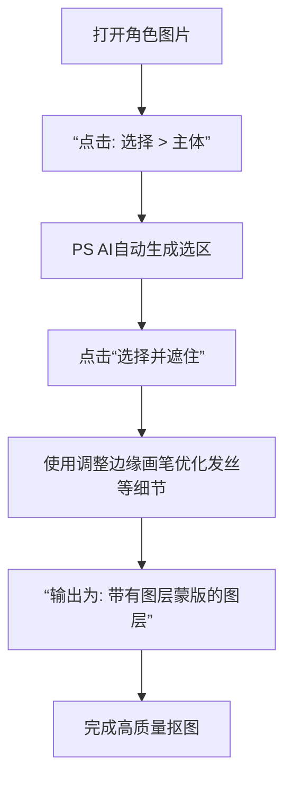

以下是 **Photoshop（PS）最常用的快捷键总结（Windows 版）**。
（macOS 用户把 Ctrl 换成 ⌘ Command，Alt 换成 ⌥ Option 即可。）

---

### 🧭 基础操作

| 功能        | 快捷键                             |
| --------- | ------------------------------- |
| 新建文件      | Ctrl + N                        |
| 打开文件      | Ctrl + O                        |
| 保存        | Ctrl + S                        |
| 另存为       | Ctrl + Shift + S                |
| 关闭文件      | Ctrl + W                        |
| 退出程序      | Ctrl + Q                        |
| 撤销/重做     | Ctrl + Z（一次），Ctrl + Alt + Z（多步） |
| 复制 / 粘贴   | Ctrl + C / Ctrl + V             |
| 剪切        | Ctrl + X                        |
| 全选 / 取消选择 | Ctrl + A / Ctrl + D             |
| 反选        | Ctrl + Shift + I                |

---

### 🧩 图层操作

| 功能       | 快捷键                               |
| -------- | --------------------------------- |
| 新建图层     | Ctrl + Shift + N                  |
| 复制当前图层   | Ctrl + J                          |
| 合并选中图层   | Ctrl + E                          |
| 合并所有可见图层 | Ctrl + Shift + E                  |
| 创建剪贴蒙版   | Ctrl + Alt + G                    |
| 选中上/下图层  | Alt + [ / Alt + ]                 |
| 显示/隐藏图层  | Ctrl + ,（点眼睛）                     |
| 图层组      | Ctrl + G / Ctrl + Shift + G（取消分组） |

---

### ✂️ 选择与移动

| 功能          | 快捷键                    |
| ----------- | ---------------------- |
| 移动工具        | V                      |
| 矩形选框 / 椭圆选框 | M（Shift + M 切换）        |
| 套索 / 多边形套索  | L（Shift + L 切换）        |
| 魔棒 / 快速选择工具 | W（Shift + W 切换）        |
| 取消选择        | Ctrl + D               |
| 羽化          | Shift + F6             |
| 变换（自由变换）    | Ctrl + T               |
| 等比例缩放       | Shift + 拖动角点           |
| 精确移动        | 方向键（Shift + 方向键 ×10px） |

---

### 🎨 绘画与编辑

| 功能          | 快捷键             |
| ----------- | --------------- |
| 画笔工具        | B               |
| 橡皮擦         | E               |
| 吸管工具        | I               |
| 渐变 / 油漆桶    | G（Shift + G 切换） |
| 克隆图章        | S               |
| 修复画笔        | J               |
| 前景色 / 背景色切换 | X               |
| 默认黑白色       | D               |

---

### 🧱 文字与形状

| 功能         | 快捷键             |
| ---------- | --------------- |
| 横排文字       | T               |
| 路径选择       | A               |
| 矩形 / 椭圆形工具 | U（Shift + U 切换） |
| 显示/隐藏文字边界  | Ctrl + H        |

---

### 🧰 视图控制

| 功能       | 快捷键                 |
| -------- | ------------------- |
| 放大 / 缩小  | Ctrl + + / Ctrl + - |
| 适合屏幕显示   | Ctrl + 0            |
| 实际像素     | Ctrl + 1            |
| 平移画布     | 空格键 + 拖动            |
| 显示/隐藏标尺  | Ctrl + R            |
| 显示/隐藏网格  | Ctrl + '            |
| 显示/隐藏参考线 | Ctrl + ;            |
| 锁定参考线    | Ctrl + Alt + ;      |

---

您说得对！Photoshop 确实有一个非常强大的 **“选择主体”** 功能，这可以说是最简单、最快捷的一键抠图方法。

这个功能利用Adobe Sensei（Adobe的AI人工智能平台）自动识别图片中的主要对象（如人物、角色、宠物、产品等）并为其创建选区。

---

### **如何使用“选择主体”功能**

**操作步骤（非常简单）：**

1.  **打开图片**：在PS中打开您需要扣除的角色图。
2.  **创建选区**：
    *   在菜单栏点击 **“选择”**。
    *   在下拉菜单中，选择 **“主体”**。
    *   Photoshop会自动分析图像，并围绕角色生成一个选区轮廓。

3.  **优化选区**：AI选区通常不会100%完美。这时，**“选择并遮住”** 工作区就至关重要。
    *   在选区激活的状态下，点击选项栏中的 **“选择并遮住”** 按钮。
    *   使用 **“调整边缘画笔工具”** 精细涂抹头发、飘带等复杂边缘。
    *   在右侧面板调整“平滑”、“羽化”、“对比度”、“移动边缘”等参数，让抠图更完美。
    *   最后输出为 **“带有图层蒙版的图层”**。

4.  **完成**：现在，角色已经被干净地抠出来了，背景是透明的。

您可以在下图中直观地了解这个工作流程：

---

### **“选择主体”功能的优点与局限性**

*   **优点**：
    *   **极速高效**：一键完成，节省大量时间。
    *   **智能准确**：对于背景不复杂、主体突出的图片，准确率非常高，是手动抠图极好的起点。

*   **局限性**：
    *   **复杂边缘处理不佳**：对于极其细碎的发丝、半透明物体（如婚纱）、与背景颜色接近的部分，AI可能无法完美识别。
    *   **依赖图片质量**：如果主体与背景对比不明显，或者图片过于杂乱，效果会打折扣。

### **最佳实践建议**

**“选择主体” + “选择并遮住”** 是目前处理绝大多数角色抠图的 **黄金组合**。

1.  先用 **“选择主体”** 快速得到90%的基础选区。
2.  再用 **“选择并遮住”** 手动优化剩下的10%的复杂细节。

这个组合在效率和效果之间取得了完美的平衡，非常适合处理《绝区零》这类二次元游戏的角色截图。

**注意**：此功能需要较新版本的Photoshop（大致从CC 2018年后的版本开始完整支持），请确保您的PS是最新或较新的版本。
